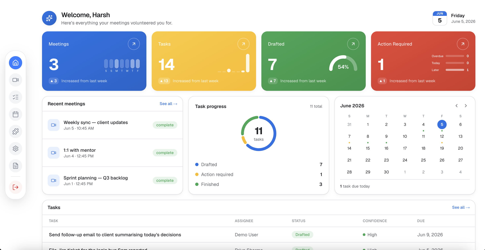
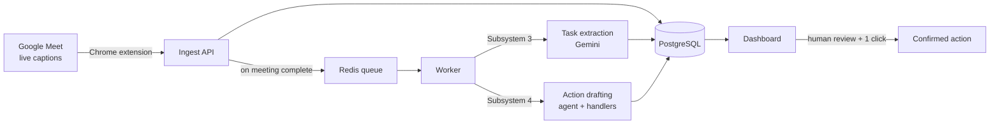
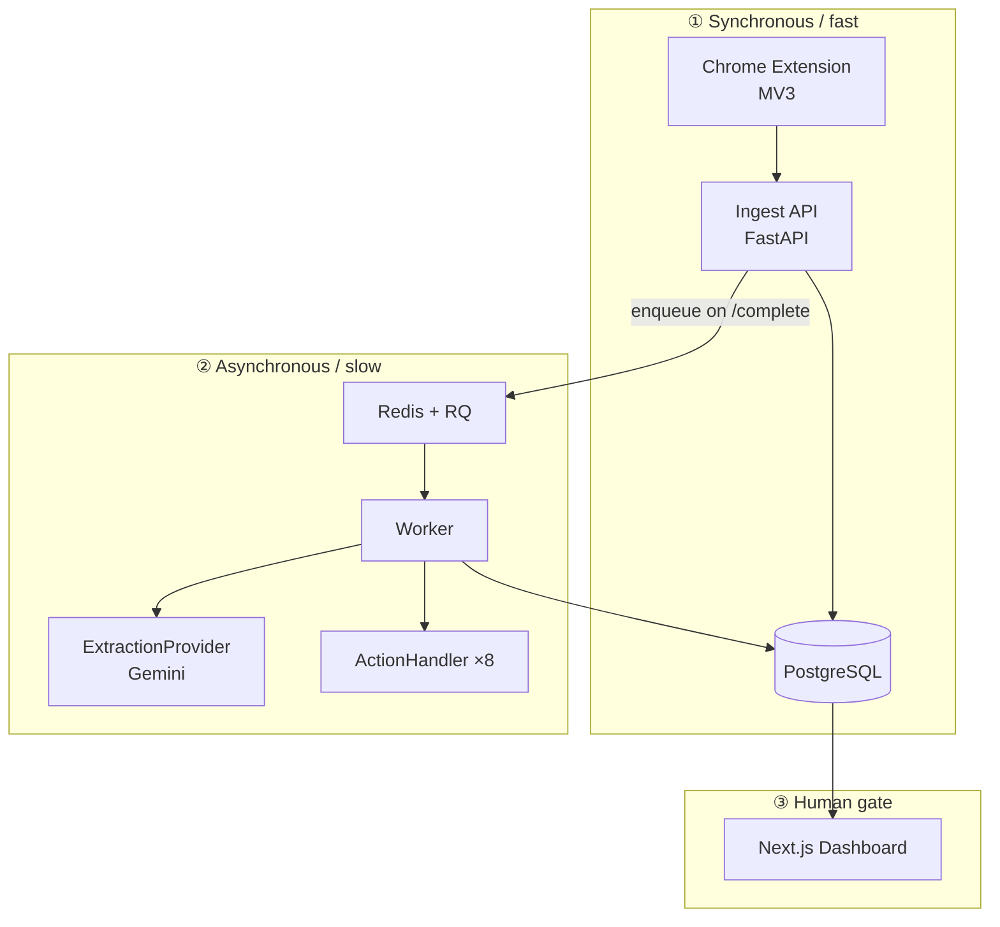

<div align="center">


# MeetPilot

**Your meetings, turned into action.**
A Chrome extension + backend that watches a Google Meet, turns the conversation into a
structured list of action items — who owes what, by when — and drafts the follow‑up work
(emails, calendar events, tickets) for one‑click human approval.

_The AI proposes. You dispose._

[](https://meet-pilot-brown.vercel.app)

<br/>


</div>

<br/>

<div align="center">
  
</div>

<br/>

---

## The problem

People forget what they were assigned in meetings. Notes get lost, follow‑ups slip, and the
"who was going to do that?" question resurfaces a week later. MeetPilot captures the meeting,
extracts the commitments automatically, and turns each one into a ready‑to‑approve draft action —
so nothing falls through the cracks.

## How it works



1. **Capture** — the extension reads Google Meet's own live captions from the DOM (already labelled
   with real speaker names) and streams them to the backend.
2. **Extract** — when the meeting ends, a background worker concatenates the transcript and asks an
   LLM for a structured list of tasks: assignee, action, deadline, confidence.
3. **Draft** — an agent routes each task to the right handler and drafts the action's fields from
   the meeting context.
4. **Approve** — you review every draft on the dashboard and confirm with a click. Nothing reaches
   the outside world automatically.

## Features

- 🎙️ **Zero‑setup capture** — no bots, no recording, no transcription. It reads Meet's existing
  captions, so speaker attribution is real, not guessed.
- 🧠 **Structured extraction** — tasks come back with **assignee**, **deadline**, and a
  **confidence** signal (🟢 high / 🟡 moderate / 🔴 review). Precision over recall — it would rather
  miss a task than invent one.
- 🗂️ **Two‑layer trust model** — confident commitments land on the main list; ambiguous ones wait
  in a **Suggested** area where you click _Add_ or _Dismiss_.
- ✍️ **Drafted follow‑ups** — eight action handlers behind one interface (see below). Email
  recipients are left **blank** for you to fill — it never guesses an address.
- 🙋 **Human‑in‑the‑loop** — the AI drafts, you approve. Nothing is sent without an explicit click.
- 📊 **Production‑grade dashboard** — meetings, a cross‑meeting tasks board, a calendar of
  deadlines, and at‑a‑glance stats.

### Action handlers

<p>
  &nbsp;&nbsp;
  &nbsp;&nbsp;
  &nbsp;&nbsp;
  &nbsp;&nbsp;
  &nbsp;&nbsp;
  &nbsp;&nbsp;
  
</p>

| Handler | Drafts | Notes |
| --- | --- | --- |
| **Gmail** | Subject + body | Recipient left blank by design |
| **Calendar event** | Multi‑person invite (attendees, time, Meet link) | |
| **Calendar deadline** | Solo all‑day reminder | No attendees |
| **Jira** | Title, description, assignee, due | |
| **Slack** | Channel + message | |
| **Notion** | Structured multi‑section doc | |
| **Asana** | Task assigned to a teammate | |
| **To‑do** | Personal item | |

Anything without a matching handler is surfaced as a **manual task**. Every action is gated on
human confirmation — the genuinely agentic part (tool selection + parameter synthesis) is
deliberately _not_ autonomous.

## Architecture

Three bands, with a clear distributed‑systems seam between the fast path and the slow path:



Three swappable interfaces are the architectural through‑line:

- **`TranscriptSource`** — only the Google Meet adapter is built (Zoom/Teams sit behind it as future work).
- **`ExtractionProvider`** — a hosted‑LLM implementation (Gemini); a self‑hosted model could swap in later.
- **`ActionHandler`** — the eight implementations above.

## Tech stack

| Layer | Technology |
| --- | --- |
| **Extension** | Vanilla JavaScript, Manifest V3 |
| **Backend** | Python · FastAPI |
| **Async** | Redis‑backed job queue (RQ) + worker process |
| **Database** | PostgreSQL (Neon) |
| **AI** | Google Gemini, behind the `ExtractionProvider` interface |
| **Frontend** | Next.js (App Router) · TypeScript · Tailwind CSS · Framer Motion |
| **Auth** | Google sign‑in only (identity scope: `openid email profile`) |

## Repository layout

```
meetpilot/
├── extension/                # Subsystem 1 — capture (vanilla JS, MV3)
│   ├── content/              #   caption MutationObserver + finalization heuristic
│   ├── background/           #   service worker: buffer, seq, periodic flush
│   ├── popup/                #   Start/Stop + token paste
│   └── shared/
├── backend/                  # FastAPI + worker
│   └── app/
│       ├── auth/             #   Google OAuth, server-side tokens
│       ├── api/              #   sessions, meetings, tasks, actions
│       ├── queue/            #   enqueue client + worker (runs S3 then S4)
│       ├── extraction/       #   provider iface, Gemini impl, prompt.py
│       └── automation/       #   router, base iface, handlers/ (the 8)
└── frontend/                 # Next.js App Router + TS + Tailwind
    └── src/app/
        ├── (marketing)/      #   public landing page
        ├── (auth)/login/     #   single "Sign in with Google"
        └── (app)/            #   dashboard, meetings, tasks, calendar (auth-guarded)
```

## Getting started (local)

**Prerequisites:** Python 3.13, Node 18+, Redis, and a PostgreSQL URL (or use the SQLite fallback).

### 1. Backend API

```bash
cd backend
python -m venv .venv && source .venv/bin/activate
pip install -r requirements.txt
cp .env.example .env            # fill in the values (see below)
uvicorn app.main:app --reload   # http://localhost:8000  ·  /docs for Swagger
```

### 2. Worker (extraction + drafting)

```bash
cd backend
# Linux:
rq worker -u "$REDIS_URL" default
# macOS (avoids a fork() crash with native libs):
rq worker -w rq.SimpleWorker -u redis://localhost:6379/0 default
```

### 3. Frontend

```bash
cd frontend
npm install
cp .env.example .env.local      # NEXT_PUBLIC_API_BASE_URL=http://localhost:8000
npm run dev                      # http://localhost:3000
```

### 4. Extension

1. Open `chrome://extensions` → enable **Developer mode**.
2. **Load unpacked** → select the `extension/` folder.
3. Sign in on the web app, copy your pairing token, and paste it into the extension popup.
4. Join a Google Meet (captions on) and hit **Start**.

### Environment variables

`backend/.env` (see `backend/.env.example`):

| Variable | Purpose |
| --- | --- |
| `DATABASE_URL` | PostgreSQL (`postgresql+psycopg://…`); omit to use SQLite locally |
| `REDIS_URL` | Job queue connection |
| `GOOGLE_API_KEY` | Gemini key for extraction |
| `GOOGLE_CLIENT_ID` / `GOOGLE_CLIENT_SECRET` | Google OAuth client |
| `GOOGLE_REDIRECT_URI` | `…/auth/google/callback` |
| `AUTH_SUCCESS_REDIRECT_URL` | Frontend `…/auth/callback` |
| `AUTH_SESSION_SECRET` | Random 32‑byte hex |
| `FRONTEND_ORIGINS` | Comma‑separated allowed origins (production CORS) |
| `COOKIE_SECURE` | `true` in production (HTTPS) |

`frontend/.env.local`: `NEXT_PUBLIC_API_BASE_URL`.

## Deployment

MeetPilot is deployed across **Vercel** (frontend), **Render** (backend API + worker), **Neon**
(PostgreSQL), and **Render Key Value** (Redis). The backend is fully env‑driven — CORS and cookie
security are controlled by environment variables, so going live is configuration, not code changes.

> 🔴 **Live:** [meet-pilot-brown.vercel.app](https://meet-pilot-brown.vercel.app)

## Design principles & scope

- **Google Meet only** for v1 — behind the `TranscriptSource` interface.
- **No speech‑to‑text, no audio processing** — captions come from Meet's DOM, already labelled.
- **No autonomous actions** — every action is human‑confirmed; nothing is sent without a click.
- **Recipients left blank** on drafted emails — it never guesses an address.
- **Precision over recall** in extraction — better to miss a task than invent one.
- **Idempotent by design** — worker retries overwrite (keyed by `session_id` / `task_id`), never
  duplicate; a confirmed action is marked done and can never be double‑sent.

## License

Released under the MIT License.

<div align="center">
<br/>
Built by <a href="https://github.com/harshcodesss">Harsh Rathi</a>
</div>
